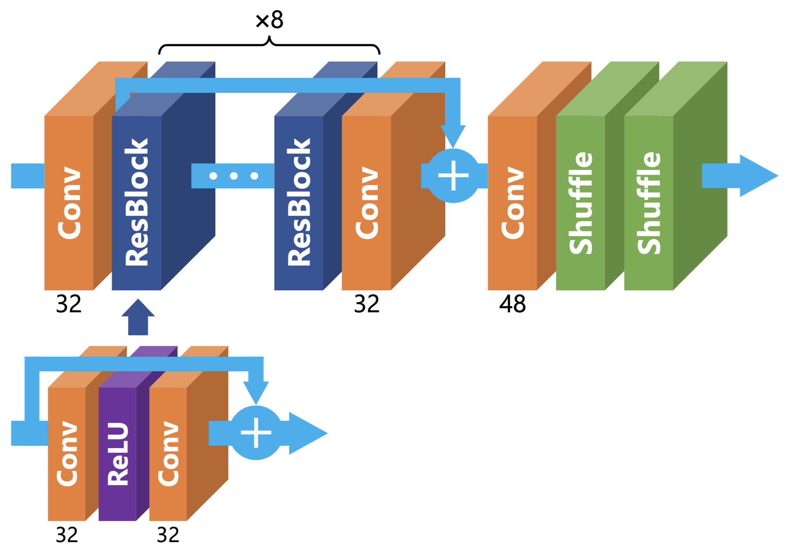

# Axell AI Contest 2024
https://signate.jp/competitions/1374

## ディレクトリ構造

    ├── README.md
    ├── requirements.txt
    ├── datasets/
    │   ├── df2k_no_person/     <- 配布データ+DIV2K+Flickr2K(without person)
    │   ├── div2k_no_person/    <- 配布データ+DIV2K(without person)
    │   ├── raw/                <- 配布データ
    │   └── sample/             <- サンプルデータ
    ├── outputs/                <- モデルの学習結果
    └── src/                    <- メインのソースコード
        ├── configs/            <- パラメータの設定
        ├── data/               <- データの前処理など
        ├── models/             <- モデル
        ├── utils/              <- ユーティリティ関数
        └── train.py            <- 学習の実行

## コンテスト概要
- 自然画像の4x超解像度コンペ。851枚のトレーニングデータと100枚のテストデータが配布される
- ONNX形式に変換して提出する
- 推論時間に`0.035s/image`の制限がある → 巨大なモデルは使えない
- 評価指標はPSNR

## 解法(最終6位)
解説記事：https://qiita.com/Koichi73/items/e98dee6c07a69942f5f6

### モデル
シンプルかつ拡張性の高いEDSRを採用。推論時間に収まるようパラメータ数を調整。

### データ
配布データに、外部データとしてDIV2KとFlickr2Kを追加。配布データに人が主要な被写体である画像がなかったため、YOLOv5を用いて外部データを調整した。

### 学習
データ拡張は反転のみ。500epochs。400epochから配布データのみで学習。  
`src/configs/240826_03.yaml`にその他の条件を記載。
